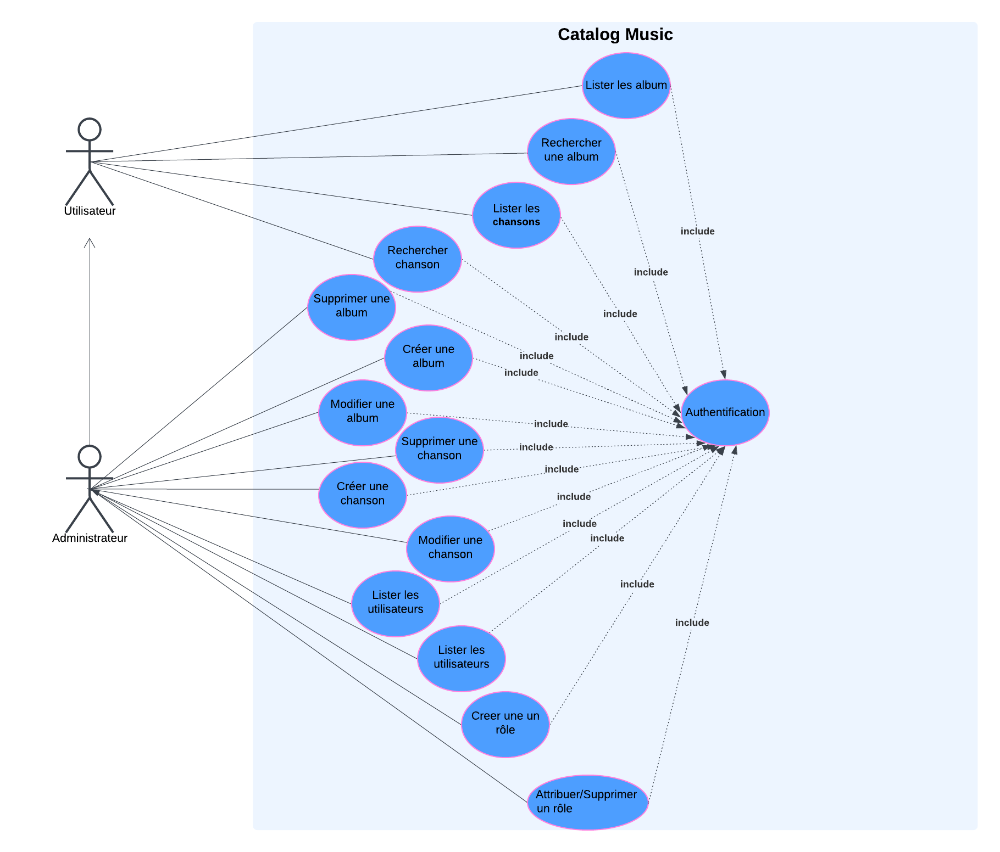
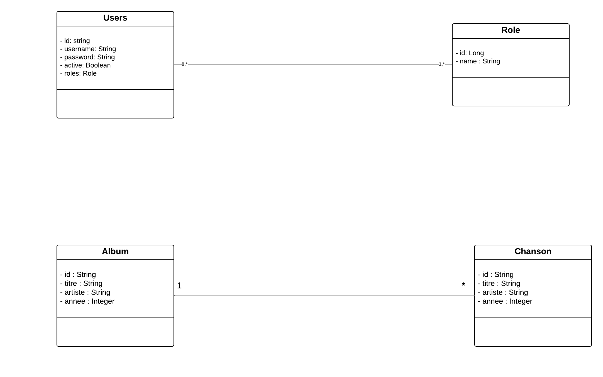

# Music Catalog API

Une API REST sécurisée pour gérer un catalogue musical (albums et chansons) construite avec Spring Boot et MongoDB.

## 🚀 Fonctionnalités

- **Authentification & Autorisation**
  - Authentification basée sur JWT
  - Contrôle d'accès basé sur les rôles (User/Admin)
  - Points de terminaison sécurisés

- **Gestion des Albums**
  - Créer, lire, mettre à jour et supprimer des albums
  - Rechercher des albums par titre, artiste
  - Filtrer des albums par année de sortie
  - Prise en charge de la pagination et du tri

- **Gestion des Chansons**
  - Créer, lire, mettre à jour et supprimer des chansons
  - Rechercher des chansons par titre, album
  - Prise en charge de la pagination et du tri

- **Gestion des Utilisateurs**
  - Inscription et connexion des utilisateurs
  - Gestion des rôles
  - Contrôle des utilisateurs administrateurs

## 🛠️ Stack Technique

- **Backend**: Spring Boot 3.2.1
- **Sécurité**: Spring Security avec JWT
- **Base de données**: MongoDB
- **Documentation**: OpenAPI (Swagger)
- **Containerisation**: Docker
- **Outil de construction**: Maven
- **Version de Java**: 17

## 📋 Prérequis

- Java 17+
- Docker et Docker Compose
- Maven 3.6+
- MongoDB (ou utiliser le conteneur Docker fourni)


## 📊 Conception UML

- **Diagramme de cas d'utilisation**



- **Diagramme de classe**




## 🚀 Pour démarrer

1. **Cloner le repository**
```bash
git clone https://github.com/JavaAura/Mokhlis_Belhaj_S4_B2_MusicCatalog.git
```
2. **Démarrer  l'application avec Docker** 
```bash
docker-compose up --build
```
3. **Accéder à l'interface utilisateur Swagger** 
```bash
http://localhost:8081/swagger-ui/index.html
```
## 📚 Endpoints de l'API

### Authentification
- POST `/api/auth/register` - Inscrire un nouvel utilisateur
- POST `/api/auth/login` - Se connecter et obtenir un token JWT

### Endpoints Utilisateur (Protegés, nécessite l'authentification)
- GET `/api/users/albums` - Obtenir tous les albums avec pagination
- GET `/api/users/albums/searchByTitle` - Rechercher des albums par titre
- GET `/api/users/albums/searchByArtist` - Rechercher des albums par artiste
- GET `/api/users/albums/filterByYear` - Filtrer des albums par année de sortie
- GET `/api/users/songs` - Obtenir toutes les chansons avec pagination
- GET `/api/users/songs/searchByTitle` - Rechercher des chansons par titre
- GET `/api/users/songs/searchByAlbum` - Rechercher des chansons par album

### Endpoints Admin (Protegés, nécessite le rôle ADMIN)
- POST `/api/admin/albums` - Créer un nouvel album
- PUT `/api/admin/albums/update` - Mettre à jour un album
- DELETE `/api/admin/albums/delete` - Supprimer un album
- POST `/api/admin/songs` - Créer une nouvelle chanson
- PUT `/api/admin/songs/{id}` - Mettre à jour une chanson
- DELETE `/api/admin/songs/{id}` - Supprimer une chanson
- GET `/api/admin/users` - Obtenir tous les utilisateurs
- POST `/api/admin/roles` - Créer un nouveau rôle
- POST `/api/admin/users/roles/{userId}` - Affecter un rôle à un utilisateur
- DELETE `/api/admin/users/roles/{userId}` - Supprimer un rôle d'un utilisateur

## 🔐 Authentification


L'API utilise JWT (JSON Web Token) pour l'authentification:

1. Inscrire un nouvel utilisateur avec `/api/auth/register`
2. Se connecter avec `/api/auth/login` pour recevoir un token JWT
3. Inclure le token dans les requêtes suivantes en utilisant l'en-tête Authorization:
   ```
   Authorization: Bearer <votre_token_jwt>
   ```

### User Roles
- **USER**: Peut voir les albums et les chansons
- **ADMIN**: Peut gérer les albums, les chansons, les utilisateurs et les rôles

### Defailt ADMIN

- **username**: admin
- **password**: admin123

## 📝 Example Requests

### Register User
```json
POST localhost:8081/api/auth/register
{
    "username": "user1",
    "password": "password123"
}
```

### Login User
```json
POST localhost:8081/api/auth/login
{
    "username": "user1",
    "password": "password123"
}
```

### Get All Albums

Authentifié avec le token JWT
Authorization : Bearer <votre_token_jwt>
```json
GET localhost:8081/api/users/albums
```


### jira 

[jira](https://belhajmokhlis.atlassian.net/jira/software/projects/MUS/boards/270)


